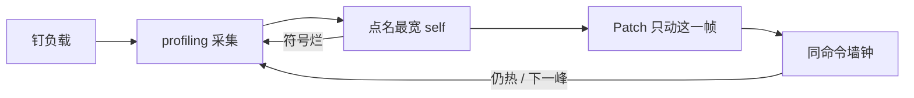

# 火焰图闭环

目的：测 → 看 → 改一帧 → **同一条命令**测墙钟。一次循环只改一处。无 `--apply` 停在「点名 self + 建议补丁」。

## 步骤

1. 钉命令指纹（bin/bench、profile、args、数据集）。写入 [profile.md](profile.md)。
2. 采图。空栈 / `[unknown]` → 停。
3. 按 [read.md](read.md) 点名一个 self。
4. 裸调用：输出建议 Patch，不改文件。`--apply` / 「改」：按 [optimize.md](optimize.md) 只动该帧所属文件。
5. 同指纹再跑墙钟（≥3 次，区间不重叠才叫变快）。不要用「图看起来窄了」当结论。
6. 无显著变化 → 回滚这一帧。还有下一峰 → 新循环，不要一次叠三个微优化。

构建时间、`target/` 体积、cargo check 慢：退出本闭环，走 `slim`。
